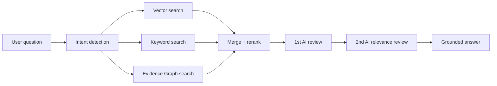

# Compass Evidence Graph MVP

## Why

Compass should answer two different classes of questions without mixing their authority:

1. Official media guide questions: what Meta, Google, Naver, Kakao, and other media officially allow, require, limit, or prohibit.
2. Operational issue questions: what actually happened during campaign setup, review, tracking, catalog, SDK/MMP, exposure, spending, or rejection incidents, and how the team resolved them.

The existing vector/keyword RAG is strong for source-grounded retrieval, but both official guide questions and operational issue knowledge need stronger structure than loose chunks. The MVP therefore adds a graph sidecar instead of replacing vector RAG.

For official guide answers, the graph layer is not a future-only case repository. It complements the existing vector stores:

- `document_chunks`: exact official source text and keyword retrieval.
- `ollama_document_chunks`: semantic/vector retrieval over official source text.
- `compass.evidence_assertions`: official guide graph assertions that label source chunks by vendor, claim type, and guide topic.

The answer should still quote and stay inside the retrieved official source range, but graph assertions help Compass know whether a chunk is about campaign objective, ad format, placement, setup procedure, review policy, commerce/measurement, or asset specs.

## Runtime Shape



## Evidence Types

| Source kind | Authority | How it should appear in answers |
| --- | --- | --- |
| `official_doc` | Official media guide or policy evidence | State as official 기준/가이드 범위 |
| `resolved_case` | Approved operational resolution | State as 실무 처리 사례 or 과거 유사 이슈 |

Official documents always win if they conflict with resolved cases. Resolved cases are retrieval candidates only after human approval.

## Graph Tables

- `compass.evidence_nodes`: vendors, documents, chunks, policy rules, ad objects, tools, data requirements, resolved cases.
- `compass.evidence_edges`: relationships such as `APPLIES_TO`, `REQUIRES`, `PROHIBITS`, `RESOLVED_BY`, `SUPPORTED_BY`.
- `compass.evidence_assertions`: answerable claims with explicit source kind, source chunk, case link, confidence, and review status.
- `compass.resolved_cases`: approved issue-resolution knowledge from real operations.
- `compass.graph_retrieval_logs`: audit trail for graph retrieval.

## Retrieval Rules

- Graph retrieval is off by default and activates only with `COMPASS_EVIDENCE_GRAPH_ENABLED=true`.
- Official guide graph indexing activates with `COMPASS_OFFICIAL_GUIDE_GRAPH_INDEXING_ENABLED=true`; if unset, it follows `COMPASS_EVIDENCE_GRAPH_ENABLED`.
- Official guide assertions are eligible when `evidence_decision='verified'` and `review_status='approved'`.
- Resolved case assertions are eligible only when the linked case has `approved_for_retrieval=true` and `resolution_status='resolved'`.
- The answer layer receives `sourceKind`, `claimType`, and `graphPath`, so it can separate official guidance from operational precedent.

## Official Guide Graph Indexing

Official source crawling and file indexing can write graph assertions after vector chunks are saved. The indexing hook is intentionally outside `VectorStorageService` so dummy chunks, placeholders, and non-official uploads do not become authoritative graph facts.

Each approved official guide assertion keeps:

- `source_kind='official_doc'`
- `source_document_id` and `source_chunk_id`
- `claim_type` such as `definition`, `requirement`, `prohibition`, `allowance`, `limit`, `procedure`, `asset_spec`, or `setup_step`
- `vendor`, `source_url`, and a compact `claim_text`
- `metadata.graphTopics` and `metadata.graphPath`

Re-indexing the same official document marks previous assertions as `stale` before inserting fresh assertions, so retrieval does not mix old and new guide structure.

## Operational Issue Answer Contract

For questions about errors, rejected delivery, campaign setup, catalog linkage, SDK/MMP, tracking specs, app events, pixel, exposure, budget burn, or targeting, answers should use:

1. 확인 순서
2. 가능한 원인
3. 조치 방법
4. 추가 확인 필요 항목

If only official guide evidence exists, say that operational case evidence has not been confirmed yet.

## Open-Beta Governance

- Keep graph ingestion separate from current official source crawling.
- Add resolved cases only after team review, not directly from raw feedback.
- Store negative feedback as a candidate, not as a retrieval-ready fact.
- Preserve current vector RAG as the source grounding baseline.
- Use the graph layer to improve recall, answer structure, and operational specificity.

## Learning Promotion

Feedback continues to enter `compass.learning_feedback` as a candidate. A reviewed item can be promoted with:

```sql
select compass.promote_learning_feedback_to_resolved_case(
  p_learning_feedback_id := 123,
  p_issue_summary := 'Meta 앱 연동 후 iOS Facebook SDK 앱이 비정상으로 노출되는 문의',
  p_resolution_summary := 'iOS Facebook SDK 앱은 약관 동의 또는 ATT 허용 상태에 따라 게재/이벤트 집계 상태가 달라질 수 있어, SDK 설치 후 1~2일 데이터 유입과 앱 이벤트 활성화 여부를 함께 확인한다.',
  p_vendor := 'META',
  p_claim_type := 'resolved_issue',
  p_reviewed_by := 'data-analysis-team'
);
```

This creates one `resolved_cases` row and one verified `evidence_assertions` row. The case becomes searchable only because the function marks it as `approved_for_retrieval=true` after review.
